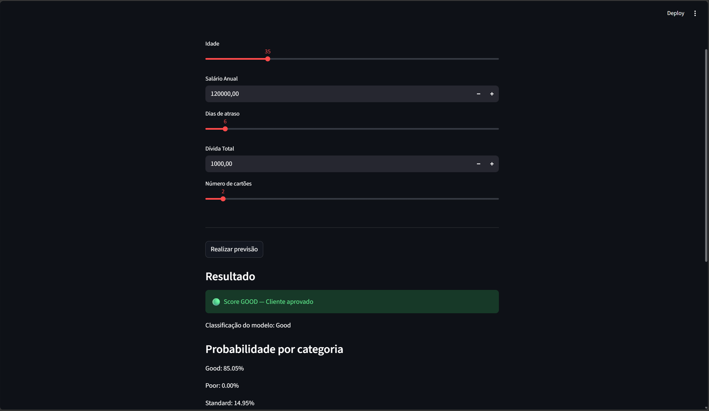
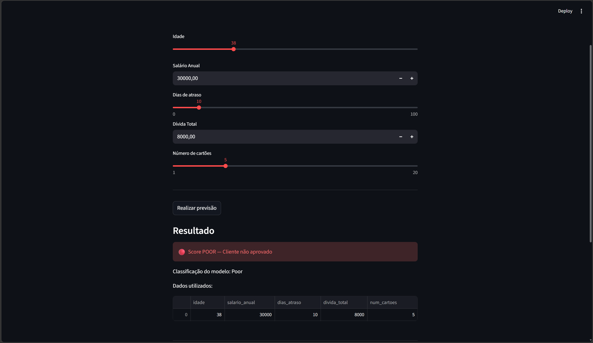

# 📊 Predição de Score de Crédito

Aplicação desenvolvida com Machine Learning para prever o score de crédito de clientes com base em informações financeiras.  
O projeto utiliza um modelo de classificação treinado com Random Forest e uma interface interativa construída com Streamlit.

---

## Tecnologias utilizadas

- Python
- Pandas
- Scikit-Learn
- Streamlit
- Joblib

---

## Estrutura do projeto

 ```txt
Previsao-clientes-ml
 ┣ assets
 ┃ ┣ previewGood.png
 ┃ ┣ previewPoor.png
 ┃ ┗ Teste - ML.gif
 ┃
 ┣ data
 ┃ ┣ clientes.csv
 ┃ ┗ novos_clientes.csv
 ┃
 ┣ notebooks
 ┃ ┗ analise_clientes.ipynb
 ┃
 ┣ app.py
 ┣ modelo.pkl
 ┣ requirements.txt
 ┗ README.md
```

---

## Funcionalidades

✔ Predição de score de crédito em tempo real  
✔ Interface web interativa com Streamlit  
✔ Classificação em Good / Standard / Poor  
✔ Modelo treinado com Random Forest  
✔ Exibição de probabilidades por categoria  
✔ Análise baseada em dados financeiros do cliente  

---

## Como executar

```bash
pip install -r requirements.txt
streamlit run app.py
```

---

## Preview

### Exemplo de aprovação

<p align="center">
  
</p>

---

### Exemplo de reprovação

<p align="center">
  
</p>

---

### Demonstração do projeto

<p align="center">
  
</p>

---

## Objetivo do projeto

Projeto desenvolvido para praticar e demonstrar conhecimentos em:

- Machine Learning
- Modelos preditivos
- Análise de dados
- Deploy local com Streamlit
- Treinamento de modelos com Scikit-Learn
- Construção de interfaces interativas em Python